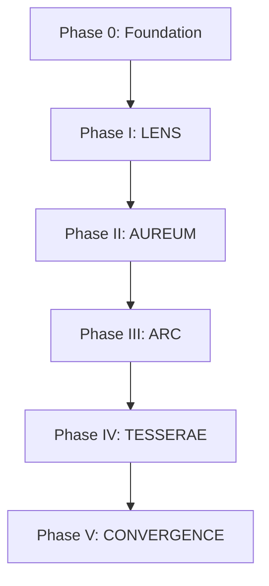

# Project Aurelis — Master Implementation Plan

**Stack:** C (kernels) + C++ (core runtime) + Python (training orchestration)  
**Source spec:** [`project.md`](../project.md)  
**Status:** Planning — no framework (no PyTorch/JAX/TensorFlow)

---

## 1. Executive Summary

Aurelis is implemented as a **custom three-tier stack**:

| Tier | Language | Responsibility |
|------|----------|----------------|
| **Hot path** | **C** | Blelloch parallel scan, diagonal recurrence, BLAS-backed matmul, quantization kernels |
| **Engine** | **C++17** | Tensor types, autodiff tape, layer graph, checkpoint I/O, inference runtime, C API boundary |
| **Orchestration** | **Python 3.11+** | Training loops, data loading, hyperparameter configs, evaluation, CPCC/ODFFB tooling |

No ML framework. Optional third-party libs: **OpenBLAS** or **Intel MKL**, **CUDA** (optional Phase I+), **pybind11** (Python↔C++ binding).

---

## 2. Repository Layout (Target)

```
transformer/
├── project.md
├── docs/
│   ├── implementation-plan.md          ← this file
│   ├── phase-0-implementation-plan.md
│   ├── phase-1-implementation-plan.md
│   ├── phase-2-implementation-plan.md
│   ├── phase-3-implementation-plan.md
│   ├── phase-4-implementation-plan.md
│   └── phase-5-implementation-plan.md
├── include/aurelis/                  # C++ public headers
├── src/
│   ├── c/                            # C kernels (.c)
│   │   ├── scan_blelloch.c
│   │   ├── recurrence_diag.c
│   │   ├── matmul_blas.c
│   │   └── quant_int4_int8.c
│   ├── core/                         # C++ engine
│   │   ├── tensor.cpp
│   │   ├── autodiff.cpp
│   │   ├── optimizer.cpp
│   │   └── checkpoint.cpp
│   ├── lens/                         # Phase I
│   ├── aureum/                       # Phase II
│   ├── arc/                          # Phase III
│   ├── tesserae/                     # Phase IV
│   └── convergence/                  # Phase V
├── python/
│   ├── aurelis/                      # pybind11 module
│   ├── train/                        # per-phase trainers
│   └── tools/                        # convert, bake, verify
├── tests/
│   ├── c/
│   ├── cpp/
│   └── python/
└── CMakeLists.txt
```

---

## 3. Phase Dependency Graph



**Rule:** Do not start Phase N+1 until Phase N exit criteria pass.

---

## 4. Language Assignment by Concern

| Concern | Language | Rationale |
|---------|----------|-----------|
| Associative scan (forward + adjoint) | C (+ optional CUDA) | O(n) work, O(log n) depth; must be cache-friendly |
| Dense matmul (CCM, FWSE, OSH) | C → BLAS | Standard optimized path |
| Cholesky, metric projection (MGP) | C++ | RAII, error handling, small matrices |
| Layer graph, state partition SPI | C++ | Type-safe composition |
| Autodiff tape | C++ | Operator graph over C kernels |
| Training loop, curriculum | Python | Rapid iteration |
| ODFFB flat binary bake/verify | Python + C++ | Serialization in C++; CLI in Python |
| Edge D3L loader | C++ | Low RAM, no Python at inference |

---

## 5. Phase Overview & Documents

| Phase | Name | Doc | Primary Deliverable |
|-------|------|-----|---------------------|
| 0 | Mathematical Foundation | [phase-0-implementation-plan.md](phase-0-implementation-plan.md) | Tensor, scan, autodiff, build system |
| I | LENS | [phase-1-implementation-plan.md](phase-1-implementation-plan.md) | O(n) sequence transducer, next-token training |
| II | AUREUM | [phase-2-implementation-plan.md](phase-2-implementation-plan.md) | Epistemic state, competence, manifold |
| III | ARC | [phase-3-implementation-plan.md](phase-3-implementation-plan.md) | Attractor reasoning, 4-pass scan |
| IV | TESSERAE | [phase-4-implementation-plan.md](phase-4-implementation-plan.md) | INR compression, edge format, D3L |
| V | CONVERGENCE | [phase-5-implementation-plan.md](phase-5-implementation-plan.md) | Epistemic frames, AGI bus, self-update |

---

## 6. Global Implementation Order (Step by Step)

### Step 1 — Phase 0 (Weeks 1–4)
Build the substrate: CMake, `Tensor`, C scan kernel, minimal autodiff, one matmul backward test.

### Step 2 — Phase I (Weeks 5–12)
Implement all 7 LENS components. Train tiny model (vocab 1k, D=256, L=4) on character-level data. Verify O(n) scaling.

### Step 3 — Phase II (Weeks 13–18)
Activate epistemic + meta channels. 3-pass scan scheduler. Competence calibration on held-out domains.

### Step 4 — Phase III (Weeks 19–24)
Activate reasoning channel. 4-pass scan. Attractor bank + mode control. CoT supervision if available.

### Step 5 — Phase IV (Weeks 25–32)
INR hypernetwork, TR cores, QAT, ODFFB bake. D3L inference under 50MB RAM budget (scaled model).

### Step 6 — Phase V (Weeks 33–40)
Epistemic frame emitter, mock downstream modules, SCE self-update loop, GFIS/CAR guards.

---

## 7. Default Hyperparameters (All Phases)

| Symbol | Value | Notes |
|--------|-------|-------|
| `D` | 512 → 2048 | Start small in Phase I |
| `D_c, D_e, D_r, D_m` | 0.5, 0.2, 0.2, 0.1 of D | SPI split |
| `L` | 4 → 24 | Layer count |
| `d_ff` | 4D | FWSE expansion |
| `K` scales | 4 | MSSP / multi-scale ε |
| `ε_k` | 0.9, 0.5, 0.1, 0.01 | Contraction bounds |

---

## 8. Testing Strategy

| Level | Tool | Scope |
|-------|------|-------|
| Unit | CTest | Scan associativity, spectral bounds, Cholesky SPD |
| Integration | pytest + C++ | One forward/backward pass per phase |
| Property | custom scripts | Complexity vs n (must be linear) |
| Regression | golden checkpoints | Perplexity + ECE bounds after each phase |

---

## 9. Exit Criteria (Project Complete)

- [ ] Forward + backward LENS pass: O(n) verified empirically
- [ ] Competence κ calibrated (ECE < 0.05 on test set)
- [ ] 4 reasoning modes switchable mid-sequence via α_t
- [ ] Compressed artifact < 500MB; peak inference RAM < 50MB (target config)
- [ ] Epistemic frames emitted; mock downstream module converges
- [ ] Self-update improves L_inner without SKIC rollback

---

## 10. Next Action

**Start Phase 0:** See [phase-0-implementation-plan.md](phase-0-implementation-plan.md) and initialize CMake + `src/c/scan_blelloch.c`.
